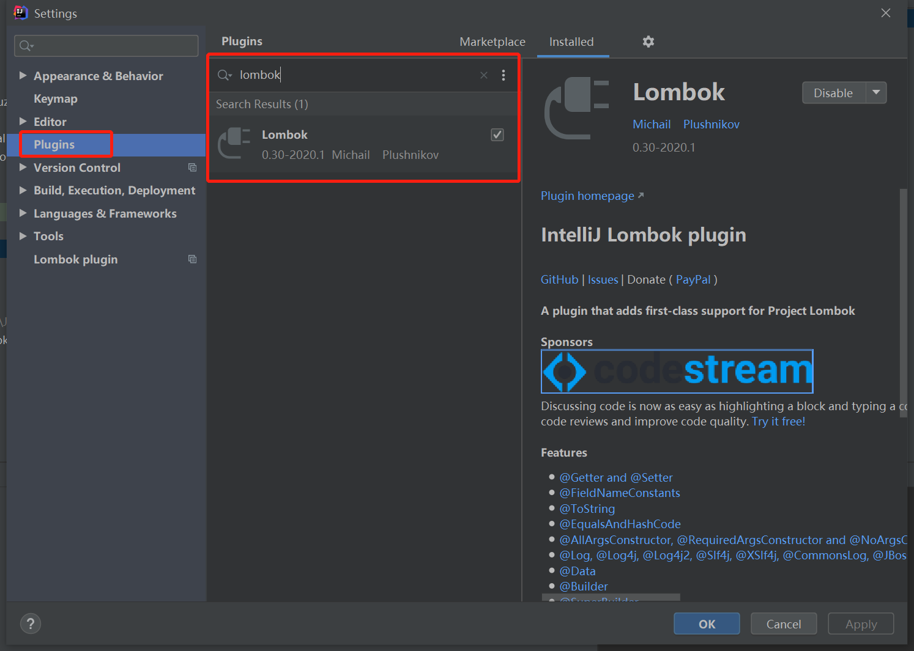

# lombok插件的使用

### 1、maven插件引入

```xml
<dependency>
    <groupId>org.projectlombok</groupId>
    <artifactId>lombok</artifactId>
    <version>1.18.12</version>
    <scope>provided</scope>
</dependency>
```

Lombok的scope=provided，说明它只在编译阶段生效，不需要打入包中。


### 2、IDE对lombok支持

  IDEA中引入Lombok支持如下：




### 3、常用注解

##### @Getter/@Setter

作用类上，生成所有成员变量的getter/setter方法.

作用于成员变量上，生成该成员变量的getter/setter方法。

```java
@Getter
@Setter
public class Animal {
    private long id;
    private String name;
    @Getter
    @Setter
    private int age;
}
```


##### @ToString：

作用于类，覆盖默认的toString()方法，可以通过of属性限定显示某些字段，通过exclude属性排除某些字段。

```java
@ToString(of = {"name", "age"})
@ToString(exclude = {"id"})
```


##### @EqualsAndHashCode

作用于类，覆盖默认的equals和hashCode


##### @NoArgsConstructor, @RequiredArgsConstructor, @AllArgsConstructor

@NoArgsConstructor：生成无参构造器；

@RequiredArgsConstructor：生成包含final和@NonNull注解的成员变量的构造器；

@AllArgsConstructor：生成全参构造器


##### @Data

作用于类上，是以下注解的集合：@ToString @EqualsAndHashCode @Getter @Setter @RequiredArgsConstructor

此注解可以满足大部分场景下的需求


### 4、类继承时要注意的

子类需要添加如下注解

```java
@EqualsAndHashCode(callSuper = true)
@ToString(callSuper = true)
```